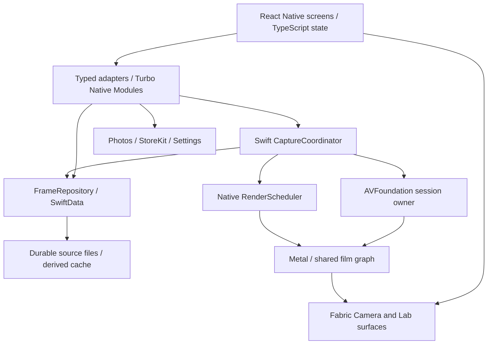

# CHEM — Kiến trúc React Native / iOS

> Quyết định triển khai đề xuất, áp dụng xuyên M0–M13. UI dùng React Native theo yêu cầu chủ repo.

## 1. Ownership



React state chứa navigation, selection/draft và snapshot của native state. Native giữ source, capture transaction, queue và entitlement xác thực. Không lưu một bản `FrameRecord` có quyền ghi riêng trong AsyncStorage/JS store. App không cần backend để chạy core workflow.

| Module | Sở hữu | Không sở hữu |
|---|---|---|
| RN feature controller | UI state, user intent, subscriptions | AVFoundation, pixels, durable transaction |
| Native adapter | DTO validation, request/event routing, lifetime | Film mathematics, nghiệp vụ lưu ảnh |
| CameraSessionController | Session topology, capabilities, active device | Film recipe, navigation |
| CaptureCoordinator | Freeze intent, source safety, capture correlation | RN lifecycle |
| ChemRenderer | Pixel transforms từ immutable descriptor | DB, purchase, network |
| RenderScheduler | Priority, cancellation, memory/thermal admission | UI route |
| FrameRepository + FileStore | Single writer, metadata, files, migrations/recovery | Camera configuration |
| ExportCoordinator | Frozen revision, encoding, output jobs | Thay đổi source |
| EntitlementStore | Verified purchase state, transaction listener | Camera readiness |

## 2. Project layout dự kiến

```text
apps/mobile/
  package.json
  src/
    app/                 # bootstrap, typed routes, dependency injection
    design-system/       # tokens, text, buttons, sheets, dials
    features/            # camera, lab, films, gallery, rolls, settings, onboarding, pro
    domain/              # serializable DTOs, UI use-case contracts
    native/              # typed wrappers, event reconciliation, fakes
    locales/             # en, vi
  specs/                 # NativeChem*.ts, Chem*NativeComponent.ts
  ios/
    CHEM/                # app host, signing, assets, permission strings
    ChemNative/
      Adapters/          # Objective-C++ glue + Swift façades
      Domain/
      CameraCore/
      Imaging/           # Metal, color, RAW, calibration
      Persistence/       # SwiftData, FileStore, migration, recovery
      Platform/          # Photos, StoreKit, haptics, permissions
      Resources/         # versioned films / device profiles
    ChemNativeTests/
  __tests__/
tools/                   # resource validation, benchmark tooling
docs/evidence/           # tạo khi bắt đầu đo và nghiệm thu
```

Giữ mockup/tài liệu root làm nguồn tham chiếu. Chọn một package manager và lockfile ở M0. Pin RN/toolchain sau compatibility spike; không dùng `latest` trong hướng dẫn build tái lập. Không yêu cầu Redux hoặc một backend chỉ để có state management; dùng feature state có selector và typed services, thêm thư viện khi có nhu cầu rõ.

## 3. Ranh giới RN/native

Typed Turbo Native Modules dùng cho command/query/event, Fabric cho native view. Swift nghiệp vụ nằm sau adapter Objective-C++ khi toolchain yêu cầu. Codegen tạo interface từ spec TypeScript; nó không tự sinh implementation AVFoundation/Metal. Xem [module guide](https://reactnative.dev/docs/turbo-native-modules-introduction), [Fabric guide](https://reactnative.dev/docs/fabric-native-components-introduction), [Swift integration](https://reactnative.dev/docs/the-new-architecture/turbo-modules-with-swift).

Các contract dưới đây là API logic; M0 phải chứng minh mọi DTO/event dùng được với Codegen của version đã pin. Dùng primitive/object/array có schema cụ thể, tránh generic union phức tạp trong spec nếu Codegen không hỗ trợ.

| Interface | Commands / query | Kết quả / event |
|---|---|---|
| `NativeChemCamera` | `getSnapshot`, `requestPermission`, `setCameraActive`, `selectLens`, `setFocus`, `setCaptureEV`, `setFlash`, `setManualControls`, `setLiveRecipe` | Lifecycle, capabilities, actual controls, acknowledged descriptor revision |
| `NativeChemCapture` | `capture(requestID, expectedSessionRevision, expectedDescriptorRevision, rollID?)` | Receipt khi sourceSafe; các tiến độ có frameID/requestID |
| `NativeChemFrames` | `listFrames(cursor, limit)`, `getFrame`, `updateRecipe(baseRevision, recipe)`, `resetRecipe`, `deleteFrame`, `getStorageUsage`, `clearDerivedCache` | Versioned DTO, conflict/error, frame change |
| `NativeChemRendering` | `renderInteractive(frameID, revision, jobID)`, `cancel(jobID)`, `getJob` | Asset handle hoặc surface update + jobID/revision |
| `NativeChemPhotos` | `pickAndImport`, `export(frameID, recipeRevision, options, requestID)`, `getExportJob`, `share(exportID)` | Import/export job snapshot, progress, recoverable error |
| `NativeChemFilms` | `listFilms`, `getFilm(id, version)`, `setFavorite` | Metadata, availability; native giữ GPU resources |
| `NativeChemSettings` | `getSettings`, `updateSettings`, roll CRUD/activation | Persisted settings/roll snapshots; có thể tách Rolls module khi lớn |
| `NativeChemEntitlements` | `getSnapshot`, `loadProduct`, `purchase`, `restore` | unknown/free/pro, pending/cancel/error, verified result |
| `ChemCameraView` / `ChemLabView` | Surface ID, active flag, layout; Lab thêm frameID/revision | Ready, display errors, geometry revision |

View không tự tạo session mới mỗi lần mount; dùng session owner ở app scope. Dùng lease/token cho attach/detach để event từ surface cũ không stop surface mới. Camera và film-detail live preview chia sẻ session; rời luồng camera để vào Lab thì giải phóng camera đúng lifecycle.

Không gửi `CMSampleBuffer`, bitmap, base64, RAW bytes hoặc mảng pixel qua JS. JS chỉ nhận ID, metadata nhỏ, progress đã throttle và URI/handle của thumbnail/output. Live và Lab interactive render trình bày qua Metal surface; RN thumbnail không được coi là bằng chứng màu của export.

## 4. Asynchrony và consistency

- API nặng là async. Session configuration có đúng một serial owner/executor; Swift `actor` không mặc nhiên đồng nghĩa dedicated camera thread. M0/M1 phải chọn executor/queue tương thích AVFoundation và strict concurrency.
- `requestID` làm idempotency key cho capture/export. JS timeout không có nghĩa native operation thất bại; query lại trước khi retry. Capture đã gửi sensor không bị hủy vì unmount.
- Event envelope: `contractVersion`, `sessionID?`, `requestID?`, `frameID?`, `jobID?`, `revision`, `sequence`, `kind`, typed payload. UI bỏ stale sequence/revision; không giả định event delivery exactly-once.
- Khi subscribe/reconnect, buffer event rồi lấy snapshot kèm sequence watermark và replay event mới hơn. Native operation/recovery tiếp tục khi JS runtime reload; snapshot là cách đồng bộ lại.
- Film/lens setting chỉ hiện active sau native ack. Shutter freeze descriptor đã thực sự active; nếu expected revision không khớp, trả conflict/reconcile thay vì chụp với film khác nhãn UI.
- Grain seed UInt64 truyền dưới dạng chuỗi thập phân/hex, không dùng JS `number` mất độ chính xác. Date dùng UTC ISO string; đường dẫn durable là relative path thuộc app, JS dùng opaque asset ID.
- Typed errors: `code`, `stage`, `recoverable`, `userAction`, `frameID?`; message sản phẩm được localize ở FE. Không ghi pixels/GPS/EXIF đầy đủ vào log.

## 5. Data và capture transaction

`FrameRecord` giữ ID, source type/components/checksum, metadata capture, orientation/dimensions/input color, captured recipe, current recipe revision, film/profile/renderer/schema versions, scene parameters/model version, grain seed, rollID, derived render references và state. `SourceBundle` có primary, RAW và processed companion optional ngay từ schema đầu.

Tách `captureState`, `renderState`, `exportState`: export không phải nghĩa vụ bắt buộc của mọi frame. `sourceSafe` yêu cầu source hợp lệ + durable metadata đủ phục hồi; `rendered` không có nghĩa đã lưu vào Photos. `capturedRecipe` bất biến; mỗi sửa Lab tạo revision, export freeze một revision cụ thể.

```text
create durable draft / requestID
→ sensor capture
→ write temporary source + checksums + recovery manifest
→ validate / close / flush / atomic rename within same volume
→ commit sourceSafe in metadata database
→ publish receipt / thumbnail
→ enqueue final render
→ persist derived render
→ optional export to Photos
```

Filesystem rename và DB commit không phải một transaction nguyên tử chung. M3 phải reconciliation được cả hai hướng: source đã rename nhưng DB chưa commit; DB sourceSafe nhưng file không đọc được do corruption/external change. Không tự xóa file source orphan chưa phân loại; quarantine và retry recovery. Source nằm `Application Support/CHEM/Frames/<UUID>/`, cache nằm `Caches/CHEM/`; cache eviction không chạm negative. Durable metadata/source không phụ thuộc JS event nhận thành công.

Delete dùng tombstone, cancel jobs, rồi xóa files/metadata có thể resume. Xóa CHEM frame không tự xóa Photos asset. Không purge source chỉ vì không còn recipe đang active hoặc user mất Pro.

## 6. Renderer contract

Descriptor snapshot bao gồm source/input semantics, film ID/version, recipe + revision, renderer version, device profile ID/version, scene parameters/model version, seed, crop/output specification. Cache key bao gồm source checksum, toàn bộ descriptor, dimensions, quality, output color/format policy; không chỉ film ID.

Một graph: decode/orientation → input/device normalization → working-space conversion → exposure/WB → film tone/color/shoulder/toe → bloom → halation → grain → crop/output color transform. Quality (`realtimePreview`, `interactiveLab`, `final`) chỉ đổi chi phí/kích thước/tối ưu kernel được kiểm chứng. Camera EV là acquisition; development EV là recipe. ISO trong tên film là character, không tự đặt ISO sensor.

Đề xuất internal extended-linear wide-gamut floating point; M4 freeze primaries/transfer/range/pixel format, từng stage chạy linear/display-referred ở đâu và policy HDR→SDR. Final HEIF Display P3 và JPEG sRGB phải transform pixels đúng rồi tag profile; đổi tag đơn thuần không phải chuyển màu.

Native scheduler ưu tiên preview/interactive, sau đó post-capture/current final, background export, batch tương lai; **source persistence có budget IO/memory riêng và không phải job GPU có thể bị starvation**. Queue preview latest-only, full-res concurrency ban đầu một job; tăng chỉ sau profiling. Thermal không được âm thầm giảm chất lượng file final.

Giữ resource/renderer implementation cũ cho mọi version public đã lưu. Nếu chưa có tương thích version cũ, hiển thị unsupported-version và bảo toàn source/render có sẵn, không silently render bằng newest. Lưu version string đơn thuần chưa đủ bảo đảm tái lập.

## 7. Các bất biến nghiệm thu

1. `sourceSafe` luôn có source và metadata recoverable.
2. Clear Cache không xóa negative; xóa trong CHEM không xóa Photos ngầm.
3. JS chết/remount không làm mất accepted capture hoặc nhân đôi session/job.
4. Preview, Lab, final/import chung semantics và versioning.
5. Không pixel stream qua JS, không full-res IO/render trên main thread.
6. Không StoreKit/network/analytics dependency trên capture hot path.
7. Old frame không bị đổi look vì app update; export của revision cũ không ghi đè revision mới.
8. Feature capability và entitlement là hai kiểm tra riêng; debug override không lọt Release.

Mỗi milestone phải chỉ ra bằng chứng cho bất biến mà nó tác động. Tài liệu hiện tại không tuyên bố bất biến đã được kiểm chứng trên app.
